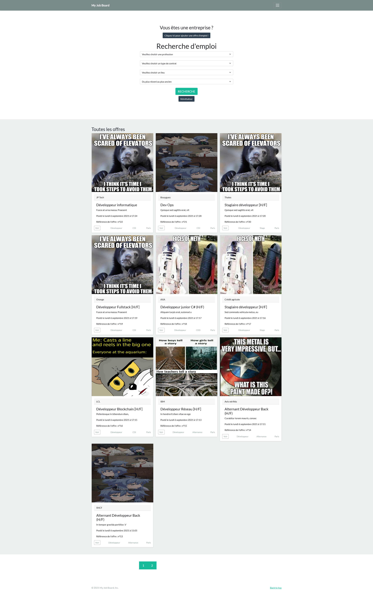

<h1 align="center">My Job Board</h1>
<h3 align="center">a PHP Project.</h3>

---

Modifier les variables dans config.php :
 
define("DB_HOST", "VOTRE HOST");
 
define("DB_USER", "VOTRE USERNAME");
 
define("DB_PASS", "VOTRE MOT DE PASSE");
 
define("DB_NAME", "jobboard_db");

---

 
 

---

### Languages and Tools

 

---

**© [LACHET Quentin](https://github.com/lachetquentin)**
